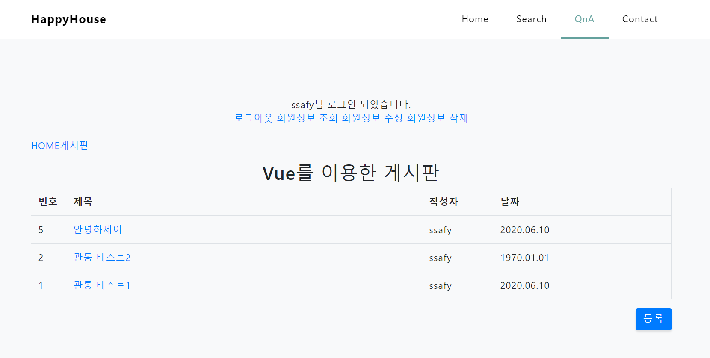
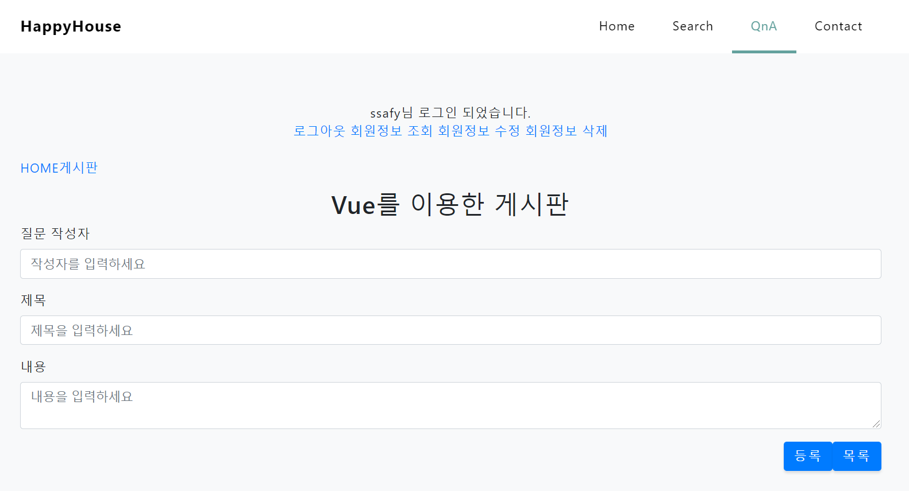
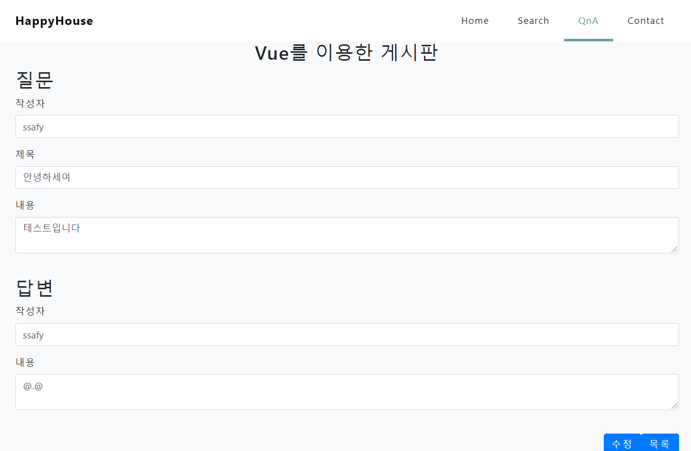
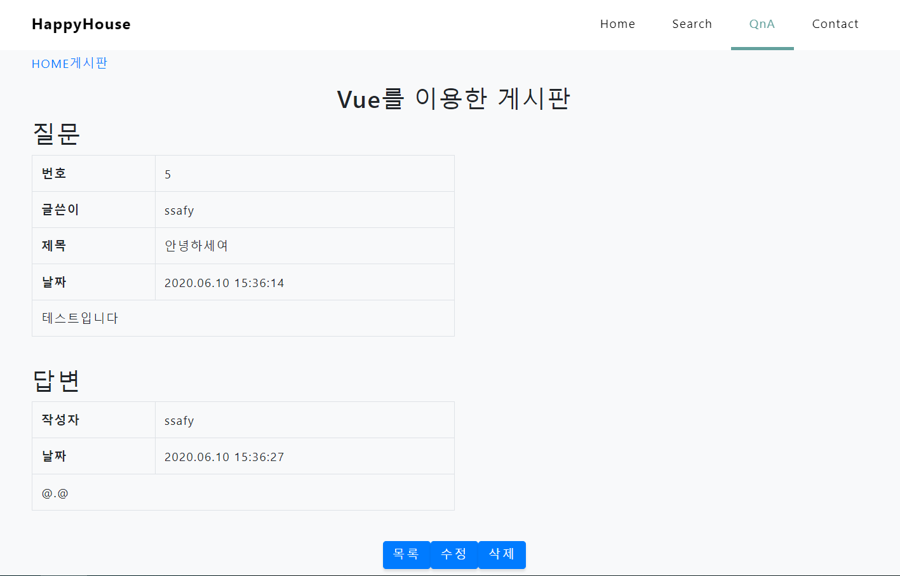

# 관통프로젝트: HappyHouse_Web_Vue_서울_14_이원오_서정하
### 제출일: 2020.06.10

### 참여 페어
- 이원오, 서정하

### 처리된 요구사항 목록
  
|난이도|구현기능|작성여부|캡쳐|
|:---:|:---:|---|:---:|
|기본|Vue를 적용한 QnA 게시글 목록|O|O|
|기본|Vue를 적용한 QnA 게시글 등록|O|O|
|기본|Vue를 적용한 QnA 게시글 수정|O|O|
|기본|Vue를 적용한 QnA 게시글 상세 검색|O|O|
|기본|서버측 구현 - 게시글 등록|O|X|
|기본|서버측 구현 - 게시글 수정|O|X|
|기본|서버측 구현 - 게시글 삭제|O|X|
|기본|서버측 구현 - 게시글 상세검색|O|X|
|기본|서버측 구현 - 게시글 목록|O|X|

### 실행화면 캡쳐    

#### - Vue를 적용한 QnA 게시판

- 게시글 목록 화면

- 게시글 등록 화면

- 게시글 수정 화면

- 게시글 상세 검색 화면

