# 관통프로젝트: HappyHouse_Web_Spring_서울_14_이원오_서정하
### 제출일: 2020.06.01

### 참여 페어
- 이원오, 서정하

### 처리된 요구사항 목록
  
|난이도|구현기능|작성여부|캡쳐|
|:---:|:---:|---|:---:|
|기본|메인 페이지|O|O|
|기본|회원관리 페이지|O|O|
|기본|로그인/로그아웃 페이지|O|O|
|기본|실거래가 검색, 결과 페이지|O|O| 

### 실행화면 캡쳐    

#### - 메인 페이지 

-  메인페이지

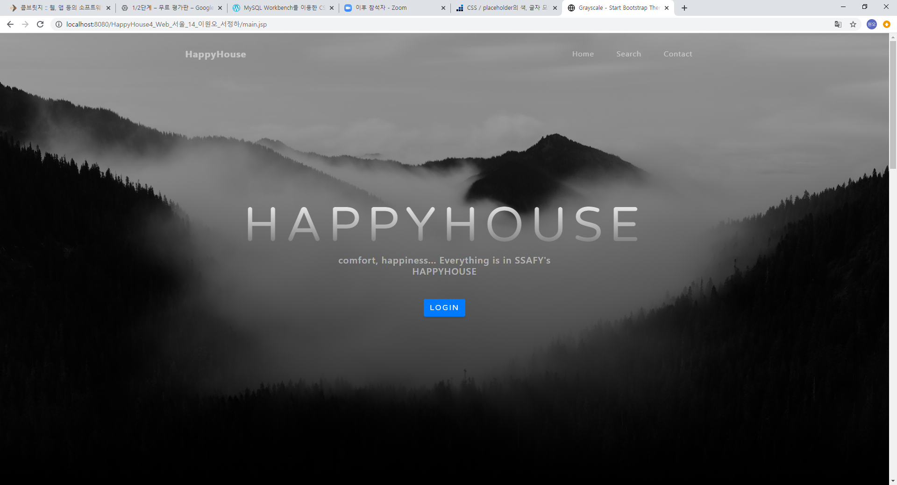

#### - 회원관리 페이지

-  회원가입

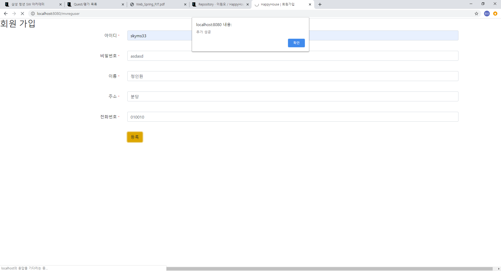

-  회원정보조회

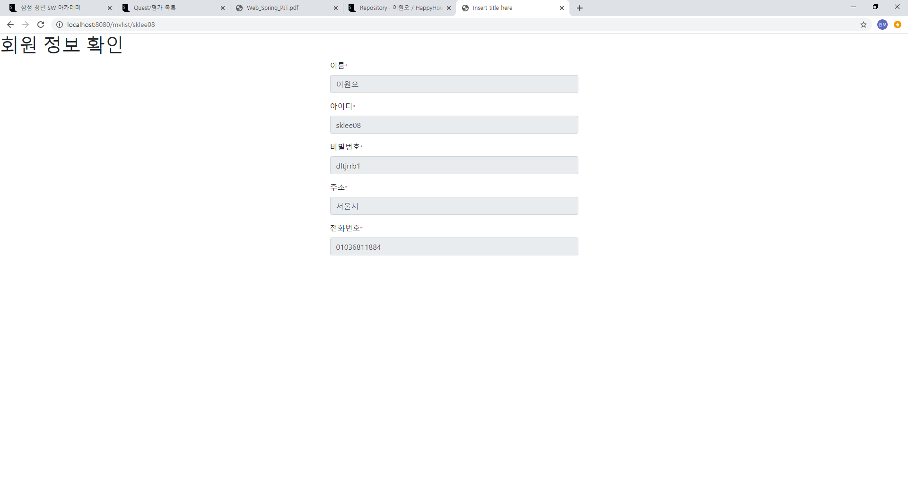

-  회원정보수정

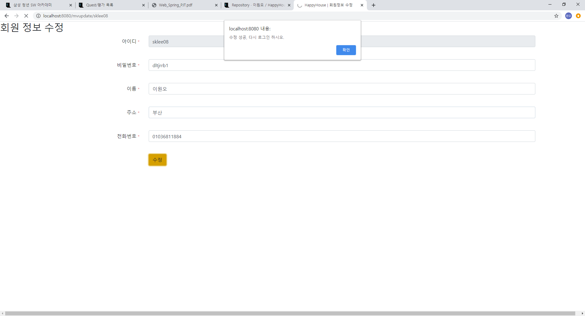

-  회원정보삭제

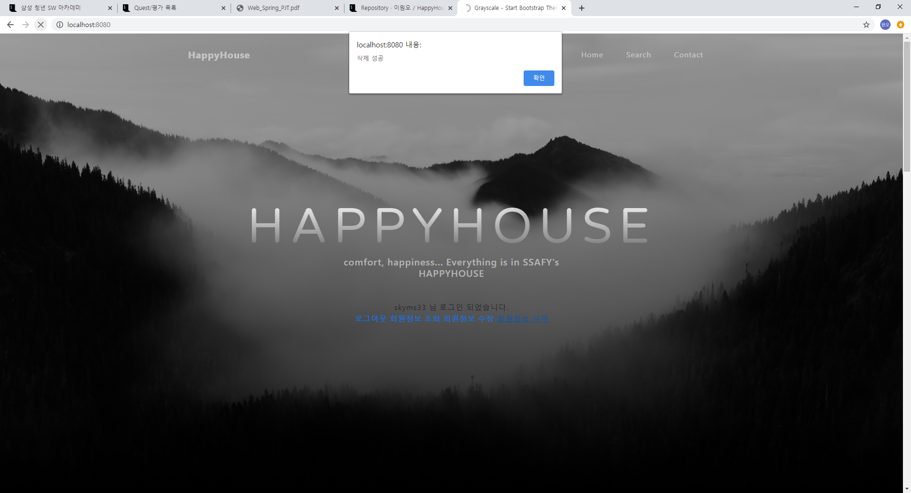

-  비밀번호찾기

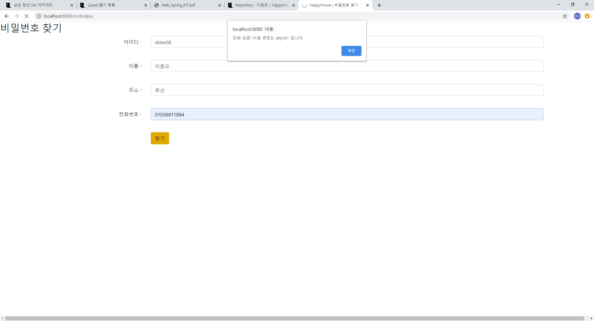

#### - 로그인/로그아웃 페이지 

-  로그인

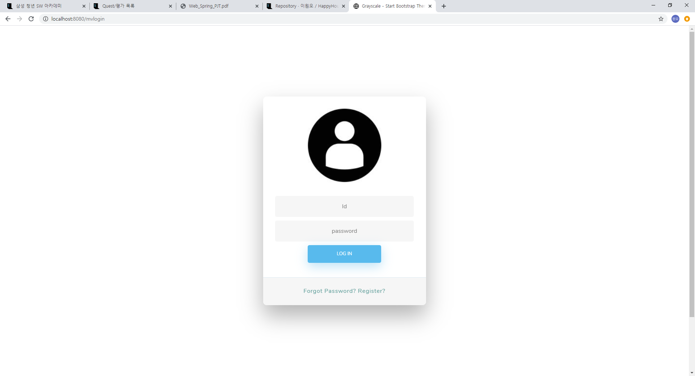
 
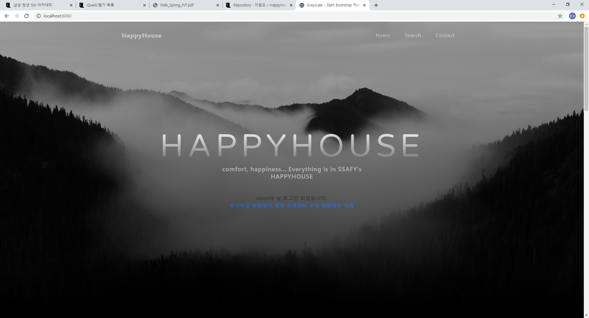 

#### - 실거래가 검색, 결과 페이지

- 전체검색화면

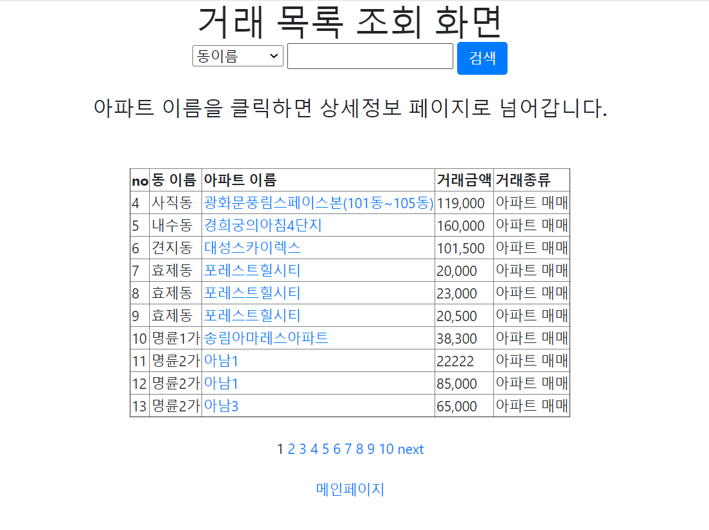

- 동별검색화면

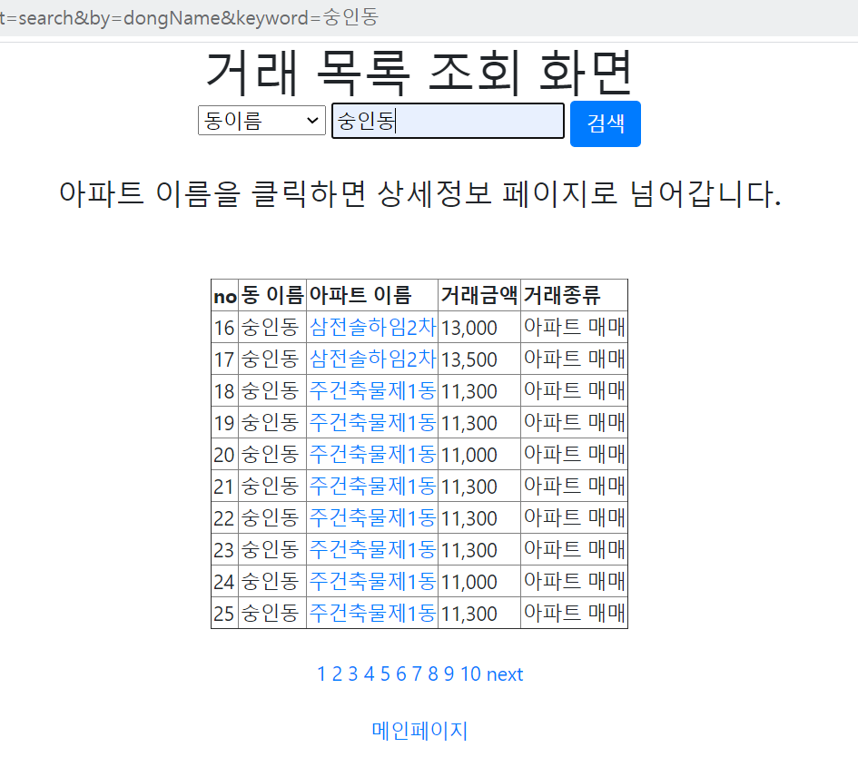

- 아파트명별검색화면

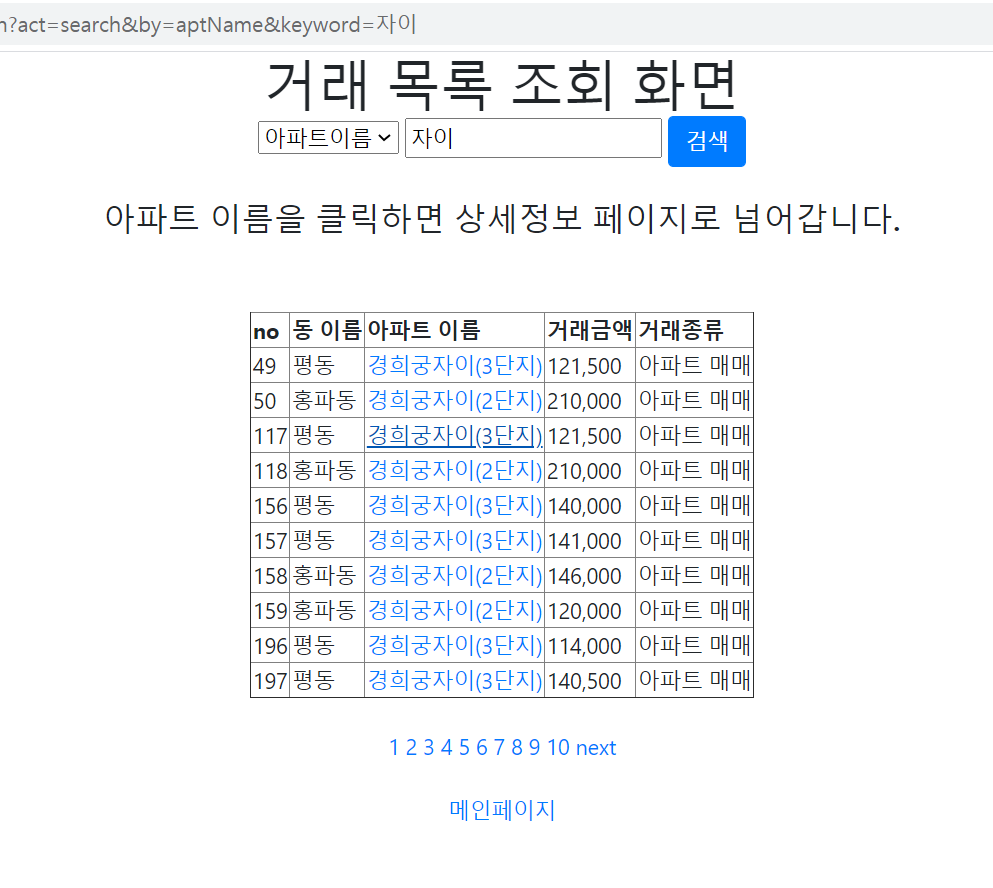

- 상세검색화면

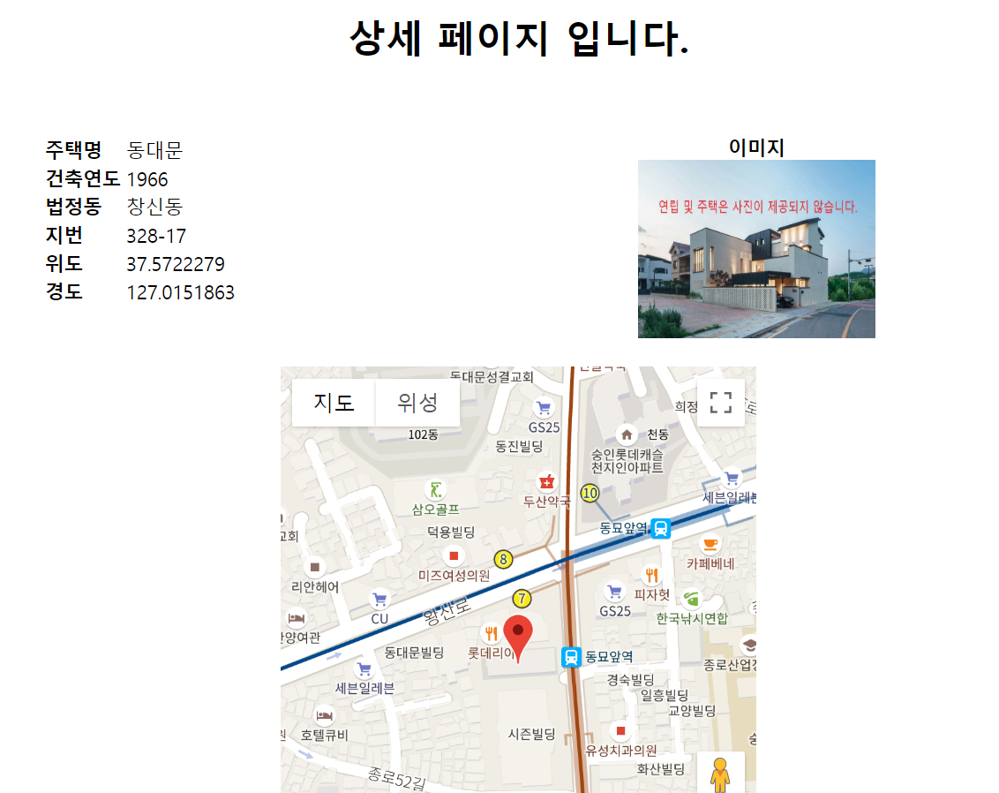

